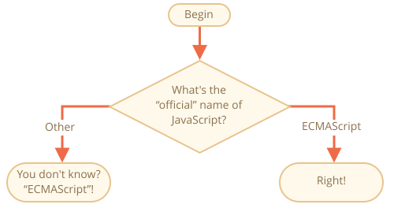

importance: 2

---

# JavaScript 的名字

使用 `if..else` 結構，寫一段程式碼詢問：'What is the "official" name of JavaScript?'

<<<<<<< HEAD
如果訪問者輸入 "ECMAScript"，則輸出 "Right!"，否則 -- 輸出："Didn't know? ECMAScript!"
=======
If the visitor enters "ECMAScript", then output "Right!", otherwise -- output: "You don't know? ECMAScript!"
>>>>>>> 725653fd99b19d42195e837ac3bb23c1784f8f6e

[demo src="ifelse_task2"]
