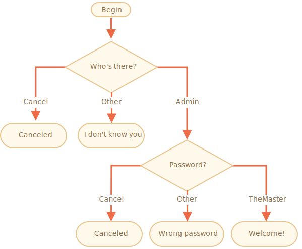

importance: 3

---

# 檢查登入

寫段程式碼使用 `prompt` 來要求登入。

若訪問者輸入 `"Admin"`，則用 `prompt` 詢問密碼；若輸入為空字串或 `key:Esc` ，則顯示 "Canceled"；若輸入其他字串，則顯示 "I don't know you"。

詢問密碼時，使用以下方式確認：

- 若輸入的是 "TheMaster"，顯示 "Welcome!"，
- 其他字串 -- 顯示 "Wrong password"，
- 空字串或取消輸入，顯示 "Canceled"。

概要：

請使用巢狀 `if` 區塊，注意整體程式碼的可讀性。

提示：傳遞沒輸入內容的結果給 prompt 會回傳空字串 `''`。在 prompt 時按下 `key:ESC` 會回傳 `null`。

[demo]
