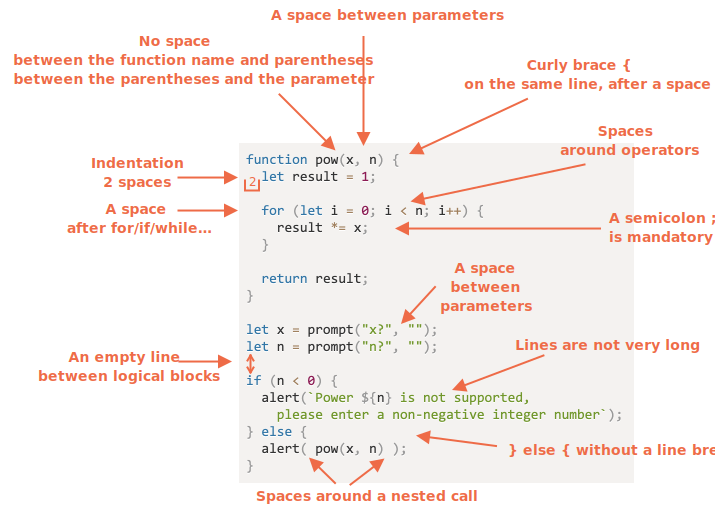

# 程式碼風格

我們的程式碼必須要盡可能乾淨易讀。

實際上這也是程式設計的藝術 -- 用正確和人眼易讀兼具的方式，寫出程式解決某個複雜的任務。

## 語法

這個備忘錄含有一些建議的規則（更多細節如下）：


<!--
```js
function pow(x, n) {
  let result = 1;

  for (let i = 0; i < n; i++) {
    result *= x;
  }

  return result;
}

let x = prompt("x?", "");
let n = prompt("n?", "");

if (n < 0) {
  alert(`Power ${n} is not supported,
    please enter a non-negative integer number`);
} else {
  alert( pow(x, n) );
}
```

-->

現在來討論一下這些規則和理由的細節吧。

```warn header="沒有任何規則是 \"你一定得\" 採用的"
沒有什麼規則是被刻在石頭上的，這只是風格喜好，不是宗教信條。
```

### 大括號

大多數 JavaScript 專案中，大括號都採用 "Egyptian" 風格書寫，意即開括號跟對應的關鍵字位於同一行 -- 而非新的一行。開括號前面應該也要留一個空格，像這樣：

```js
if (condition) {
  // 這麼做
  // ...還有那樣
  // ...跟那樣
}
```

單行結構，如 `if (condition) doSomething()`，也是個重要的邊緣案例，我們究竟是否該使用括號？

這邊有對於各種變化的解說，你可以自行判斷它們的可讀性：

1. 😠 初學者有時候這麼做。不佳！不需要大括號：
    ```js
    if (n < 0) *!*{*/!*alert(`Power ${n} is not supported`);*!*}*/!*
    ```
2. 😠 換到新的一行卻沒使用大括號。千萬別這麼做，這很容易在增加新的一行時出錯：
    ```js
    if (n < 0)
      alert(`Power ${n} is not supported`);
    ```
3. 😏 單行時不使用括號 - 若內容短的話還算可以接受：
    ```js
    if (n < 0) alert(`Power ${n} is not supported`);
    ```
4. 😃 最棒的寫法：
    ```js
    if (n < 0) {
      alert(`Power ${n} is not supported`);
    }
    ```

對很短的程式碼而言，單行是允許的，像是 `if (cond) return null`。但具有程式碼區塊（最後一種寫法）通常會更為可讀。

### 行長度

沒人喜歡讀一行水平又冗長的程式碼，最佳做法是將它們拆分。

例如：

```js
// 反引號 ` 允許拆分某字串成多行
let str = `
  ECMA International's TC39 is a group of JavaScript developers,
  implementers, academics, and more, collaborating with the community
  to maintain and evolve the definition of JavaScript.
`;
```

並且，對於 `if` 述語而言：

```js
if (
  id === 123 &&
  moonPhase === 'Waning Gibbous' &&
  zodiacSign === 'Libra'
) {
  letTheSorceryBegin();
}
```

最大行長度應該要在團隊層級上取得共識，通常為 80 或 120 個字元。

### 縮排

有兩種類型的縮排：

- **水平縮排：2 或 4 個空格。**

    水平縮排可使用 2 或 4 個空格，或水平 tab 符號（key `key:Tab`）。要選用哪種方式早已是古老的聖戰了，現今空格較為普遍。

    使用空格而非 tabs 有個好處是，空格比 tab 符號更具有縮排配置的彈性。

<<<<<<< HEAD
    舉個例，我們可以將某個開括號的引數們對其，像這樣：
=======
    For instance, we can align the parameters with the opening bracket, like this:
>>>>>>> 7533c719fbf62ba57188d6d51fe4c038b282bd0c

    ```js no-beautify
    show(parameters,
         aligned, // 左側有 5 個空格
         one,
         after,
         another
      ) {
      // ...
    }
    ```

- **垂直縮排：用空行分割程式碼邏輯區塊。**

    即使是單個函式通常也可以被切分多個邏輯區塊。底下的例子中，變數的初始化、主要迴圈和回傳結果被垂直拆分開來：

    ```js
    function pow(x, n) {
      let result = 1;
      //              <--
      for (let i = 0; i < n; i++) {
        result *= x;
      }
      //              <--
      return result;
    }
    ```

    在這些位置插入額外一行可以讓程式碼更具可讀性，不應該存在連續 9 行都沒有看到垂直縮排的程式碼。

### 分號

分號應該在每個述語後出現，就算它或許可以省略。

有些程式語言的分號是真的可選並很少使用的。但在 JavaScript 中，有些情況下斷行不會被直譯成分號，這將造成程式碼易於出錯，參考章節 <info:structure#semicolon> 可以看到更多內容。

若你是個有經驗的 JavaScript 程式設計師，你可以選擇無分號的程式碼風格，像是 [StandardJS](https://standardjs.com/)，否則最好是使用分號來避免可能的陷阱。大多數的開發者都會使用分號。

### 巢狀層級

試著避免使用太多層的巢狀程式碼。

例如，在迴圈中使用 [`continue`](info:while-for#continue) 指令有時候是個避免巢狀的好辦法。

舉個例，不像這樣使用巢狀 `if` 條件式：

```js
for (let i = 0; i < 10; i++) {
  if (cond) {
    ... // <- 多一層巢狀層級
  }
}
```

我們可以這樣寫：

```js
for (let i = 0; i < 10; i++) {
  if (!cond) *!*continue*/!*;
  ...  // <- 沒有額外巢狀層級
}
```

`if/else` 與 `return` 也可以做到類似的事。

例如，底下兩種結構是相同的。

選擇一：

```js
function pow(x, n) {
  if (n < 0) {
    alert("Negative 'n' not supported");
  } else {
    let result = 1;

    for (let i = 0; i < n; i++) {
      result *= x;
    }

    return result;
  }  
}
```

選擇二：

```js
function pow(x, n) {
  if (n < 0) {
    alert("Negative 'n' not supported");
    return;
  }

  let result = 1;

  for (let i = 0; i < n; i++) {
    result *= x;
  }

  return result;
}
```

第二種選擇更具可讀性，因為 `n < 0` 的 "特別情況" 已被提前處理。一旦完成檢查，我們就可以繼續移動到 "主" 程式碼流程中，而不需要額外的巢狀結構。

## 函式位置

若你正在寫些 "輔助（helper）" 函式與使用它們的程式碼，有三種組織函式的方式。

1. 在使用它們的程式碼 *上方*，宣告這些函式：

    ```js
    // *!*函式宣告*/!*
    function createElement() {
      ...
    }

    function setHandler(elem) {
      ...
    }

    function walkAround() {
      ...
    }

    // *!*使用函式的程式碼*/!*
    let elem = createElement();
    setHandler(elem);
    walkAround();
    ```
2. 先寫程式碼，再寫函式

    ```js
    // *!*使用函式的程式碼*/!*
    let elem = createElement();
    setHandler(elem);
    walkAround();

    // --- *!*輔助函式*/!* ---
    function createElement() {
      ...
    }

    function setHandler(elem) {
      ...
    }

    function walkAround() {
      ...
    }
    ```
3. 混合用法：函式在第一次被使用時宣告。

大多數時候，第二種做法較為適合。

因為當閱讀程式碼時，我們首先希望知道 *它做了什麼*。如果程式碼在前，那一開始就會很清楚在做什麼。而且或許我們根本不需要閱讀這些函式，尤其是當它們的名字已清楚描述了它們做了什麼時。

## 風格指南

風格指南包括了 "如何撰寫" 程式碼的通用規則，像是使用哪一種引號、縮排要多少空格和最大行長度，等等的小細節。

當團隊所有成員都使用同樣的程式碼指南，不論哪一個是哪個成員寫的程式碼，都將具有一致性。

當然，團隊隨時可以寫下它們自身的風格指南，但通常它們不需要這麼做，已經有許多既存的風格可以選擇。

一些受歡迎的選擇：

- [Google JavaScript Style Guide](https://google.github.io/styleguide/jsguide.html)
- [Airbnb JavaScript Style Guide](https://github.com/airbnb/javascript)
- [Idiomatic.JS](https://github.com/rwaldron/idiomatic.js)
- [StandardJS](https://standardjs.com/)
- （還有許多）

若你是個初學開發者，先從本章最前面的備忘錄開始。然後你可以瀏覽其它風格指南來獲得些想法，並決定你最喜歡的一個。

## 自動化 Linters

Linters 是可以自動檢查你程式碼風格，並給予改進建議的工具。

它們有個很棒的地方是，在檢查風格時也可能找到些問題（bugs），像是變數或函式名字拼錯之類的。因為這個特性，就算你不想遵守某種特定的 "風格指南"，也建議你要使用 linter。

這些是知名的 linting 工具：

- [JSLint](http://www.jslint.com/) -- 第一批的 linter 之一。
- [JSHint](http://www.jshint.com/) -- 可以比 JSLint 做更多設定。
- [ESLint](http://eslint.org/) -- 也許是目前最新的一個。

以上皆可，作者是使用 [ESLint](http://eslint.org/)。

大部分 linters 都有和熱門的編輯器整合：只要在編輯器內啟用插件並設置風格即可。

舉個例，對 ESLint 而言你只要按照下面步驟：

1. 安裝 [Node.js](https://nodejs.org/)。
2. 使用命令 `npm install -g eslint` 安裝 ESLint（npm 是 JavaScript 的套件安裝工具）。
3. 在你 JavaScript 專案的根目錄（包含你所有檔案的那個資聊夾），建立一個名為 `.eslintrc` 的配置檔。
4. 安裝/啟用 ESLint 整合在你編輯器內的插件，大多數編輯器都會有。

這是 `.eslintrc` 檔案的例子：

```js
{
  "extends": "eslint:recommended",
  "env": {
    "browser": true,
    "node": true,
    "es6": true
  },
  "rules": {
    "no-console": 0,
    "indent": 2
  }
}
```

`extends` 這個指令表示配置是基於 "eslint:recommended" 來設定，此外我們還制定了自己的規則。

或者也可以從網路下載風格規則集合並延伸使用，查看 <http://eslint.org/docs/user-guide/getting-started> 以了解更多安裝細節。

甚至某些特定 IDEs 很方便的內建 linting，但不像 ESLint 那樣可以自行客製化。

## 總結

所有本章提到的語法規則（和風格指南）都只是為了增加你程式碼的可讀性，所以全都是可以再討論的。

當我們思考怎樣寫出 "更好的" 程式碼時，我們應該自問："怎樣才能讓程式碼更為易讀好理解呢？" 和 "什麼能夠讓我們避免產生錯誤？" 這些都是選擇討論用什麼程式碼風格時，必須保持在心中最重要的事。

閱讀熱門的風格指南可以讓你跟上最新的程式碼風格潮流與最佳做法。

